# 🎖️ Certifications & Digital Badges

[⬅ Back to Home](../README.md)

---

## Credly Profile

All verified certifications and digital badges are on my Credly profile:

**🔗 [View my Credly badges →](https://www.credly.com/users/stephine-hubert-campos)**

---

Below are the certifications and digital badges I have earned, grouped by category. Each badge includes its image, name, and a link to verify on Credly.

---

## 👩‍🏫 Instructor Service

| Badge | Certification | Verification |
|-------|---------------|--------------|
|  
| Instructor 1 Year of Service (Cisco) | 
<a href="https://www.credly.com/badges/608ca1e4-647b-4777-9a30-1244605dd119" target="_blank">Verify</a>
 |
|  | Instructor 5 Years of Service (Cisco) | [Verify](https://www.credly.com/badges/9cf09fd1-7623-4b9c-ac8c-f919af357e46) |

---

## 🌐 Networking

| Badge | Certification | Verification |
|-------|---------------|--------------|
| 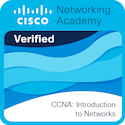 | CCNA: Introduction to Networks | [Verify](https://www.credly.com/badges/54001af3-82b8-4edf-812d-d5c3039e97f2) |
| 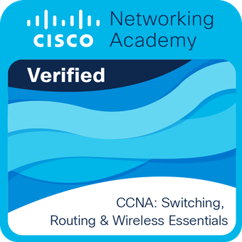 | CCNA: Switching, Routing, and Wireless Essentials | [Verify](https://www.credly.com/badges/9bbdb0d4-6cd3-4ce3-8430-9bb1aeaa99a5) |
| 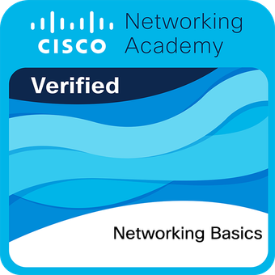 | Networking Basics | [Verify](https://www.credly.com/badges/75588756-a465-44c6-a442-1c7c6c2cbd3c) |
| 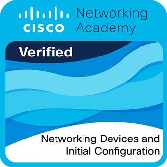 | Networking Devices and Initial Configuration | [Verify](https://www.credly.com/badges/526b9e28-6a51-4d09-9cbe-4e54c08630c0) |
| 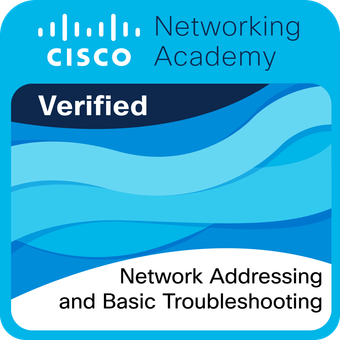 | Network Addressing and Basic Troubleshooting | [Verify](https://www.credly.com/badges/ce76c731-694f-455d-a908-513d92e3f9eb) |
| 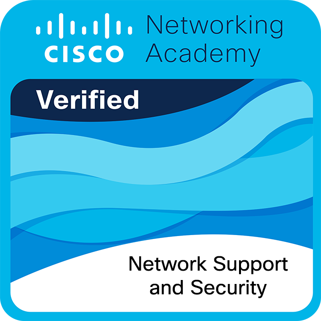 | Network Support and Security | [Verify](https://www.credly.com/badges/ca594aa5-20f3-4ea7-a3e5-8c447f9aecd1) |
|  | Network Technician Career Path | [Verify](https://www.credly.com/badges/f1f1f677-e03d-484f-87ff-f7e0dd3fe002) |

---

## 🔐 Cybersecurity

| Badge | Certification | Verification |
|-------|---------------|--------------|
| 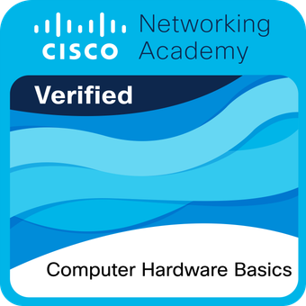 | Computer Hardware Basics | [Verify](https://www.credly.com/badges/37de42f1-8e6d-4470-a083-fb2fba5ac9ea) |
| 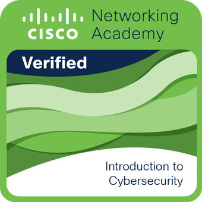 | Introduction to Cybersecurity | [Verify](https://www.credly.com/badges/d913c89b-5d17-401e-aa60-0f508b10e3b5) |
|  | Endpoint Security | [Verify](https://www.credly.com/badges/3aad8e8f-0861-4f01-9539-c53f93c8b90e) |
| 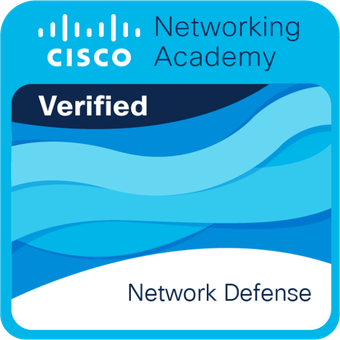 | Network Defense | [Verify](https://www.credly.com/badges/ea38672f-f34a-45a9-80f3-99000847b91a) |
|  | Cyber Threat Management | [Verify](https://www.credly.com/badges/5e83e3b6-1a47-4c2d-acb0-9da7af0596cf) |
|  | Junior Cybersecurity Analyst Career Path | [Verify](https://www.credly.com/badges/a58237f8-1298-4f28-87db-04d1d554b4f9) |

---

## 📡 Emerging Technologies

| Badge | Certification | Verification |
|-------|---------------|--------------|
| 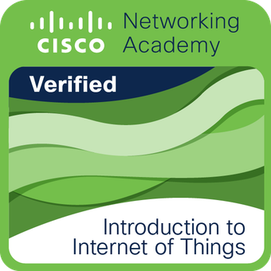 | Introduction to IoT | [Verify](https://www.credly.com/badges/c83b90d8-cb92-48fe-a164-2b07c2708471) |

---

## 📊 Data & AI

| Badge | Certification | Verification |
|-------|---------------|--------------|
| 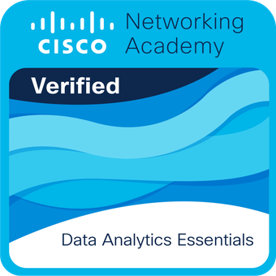 | Data Analytics Essentials | [Verify](https://www.credly.com/badges/559b47e7-2d24-4d3d-a201-62c9e1e93536) |
| 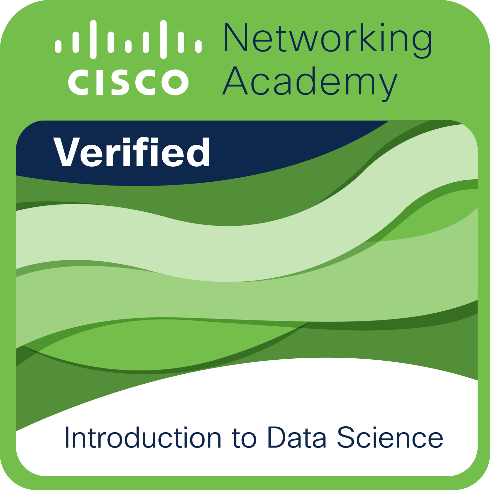 | Introduction to Data Science | [Verify](https://www.credly.com/badges/4731537a-b115-42db-be95-43bb3068e333) |
| 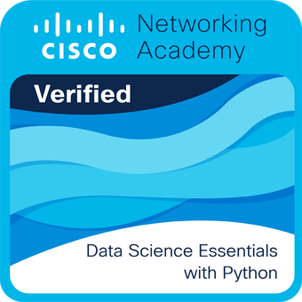 | Data Science Essentials With Python | [Verify](https://www.credly.com/badges/05faf84d-de73-4020-8972-e1ca333980c9) |
| 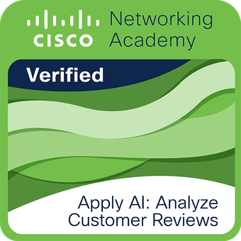 | Apply AI: Analyze Customer Reviews | [Verify](https://www.credly.com/badges/bc1a5057-ffc8-4eb9-a871-4001d91f3d91) |
|  | Apply AI: Update Your Resume | [Verify](https://www.credly.com/badges/5fc61d3d-906a-4fd3-8125-b5b548a24b65) |
| 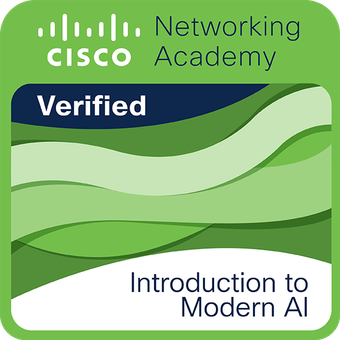 | Introduction to Modern AI | [Verify](https://www.credly.com/badges/47581afe-453a-4502-bb27-df148f1d0e90) |
| 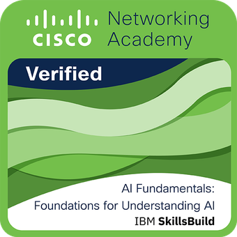 | AI Fundamentals: Foundations for Understanding AI | [Verify](https://www.credly.com/badges/63b67458-b8f1-44d3-86bf-5a1d95d2e32a) |

---

[⬅ Back to Home](../README.md)
